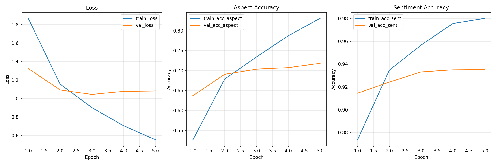

# ABSA Training Report

- **Run ID**: `20260528-222516`
- **Architecture**: `bert (bert-base-uncased)`
- **Device**: `cuda`
- **CSV**: `C:\Users\Administrator\Desktop\ABSANLPFN - Copy\ok050824.csv` (103923 total rows)
- **Samples used**: 30000 (max_samples=30000)
- **Train/Val split**: 25500 / 4500
- **Epochs**: 5
- **Batch size**: 64
- **Learning rate**: 2e-05
- **Dropout**: 0.25
- **Max len**: 128

## Final Metrics (Validation Set)

| Task | Accuracy | Precision | Recall | F1 |
|------|----------|-----------|--------|-----|
| Aspect | 0.7169 | 0.5718 | 0.5412 | 0.5497 |
| Sentiment | 0.9351 | 0.8995 | 0.8557 | 0.8736 |

## Training Curves

## Last 5 Epochs

| Epoch | Train Loss | Val Loss | Train Acc Aspect | Val Acc Aspect | Train Acc Sent | Val Acc Sent |
|-------|-----------|---------|-----------------|---------------|---------------|-------------|
| 1 | 1.8666 | 1.3248 | 0.5266 | 0.6370 | 0.8736 | 0.9145 |
| 2 | 1.1563 | 1.0935 | 0.6786 | 0.6906 | 0.9347 | 0.9242 |
| 3 | 0.9029 | 1.0445 | 0.7343 | 0.7037 | 0.9567 | 0.9332 |
| 4 | 0.7060 | 1.0783 | 0.7872 | 0.7074 | 0.9756 | 0.9350 |
| 5 | 0.5558 | 1.0826 | 0.8309 | 0.7182 | 0.9801 | 0.9353 |
