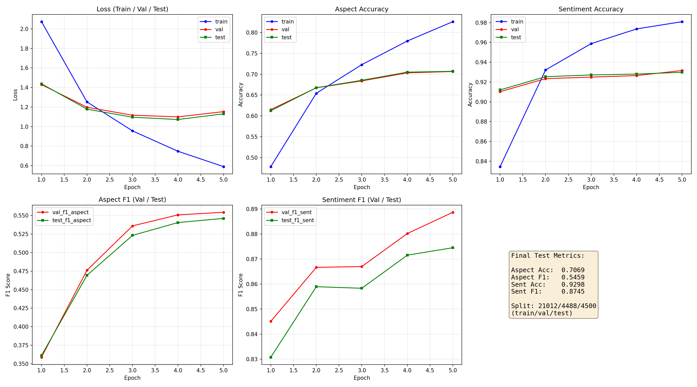
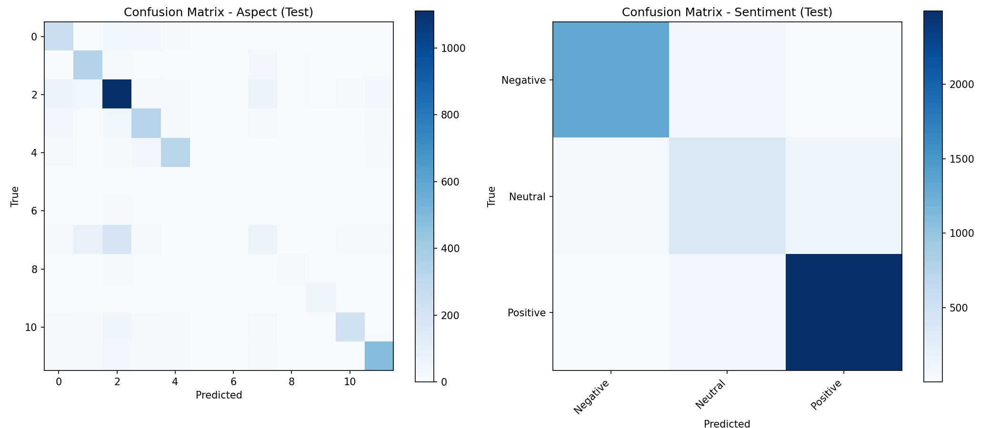

# ABSA Training Report

- **Run ID**: `20260528-232134`
- **Architecture**: `bert (bert-base-uncased)`
- **Device**: `cuda`
- **CSV**: `C:\Users\Administrator\Desktop\ABSANLPFN - Copy\ok050824.csv` (103923 total rows)
- **Samples used**: 30000 (max_samples=30000)
- **Split**: Train 21012 / Val 4488 / Test 4500 (70/15/15)
- **Epochs**: 5
- **Batch size**: 64
- **Learning rate**: 2e-05
- **Dropout**: 0.25
- **Max len**: 128

## Results on TEST Set

| Task | Accuracy | Precision | Recall | F1 |
|------|----------|-----------|--------|-----|
| Aspect | 0.7069 | 0.5576 | 0.5467 | 0.5459 |
| Sentiment | 0.9298 | 0.8768 | 0.8722 | 0.8745 |

## Results on Validation Set

| Task | Accuracy | Precision | Recall | F1 |
|------|----------|-----------|--------|-----|
| Aspect | 0.7063 | 0.5677 | 0.5526 | 0.5542 |
| Sentiment | 0.9316 | 0.8904 | 0.8869 | 0.8886 |

## Training Curves

## Confusion Matrix (Test Set)

## Training History (Last 5 Epochs)

| Epoch | Train Loss | Val Loss | Test Loss | Val Acc Asp | Test Acc Asp | Val F1 Asp | Test F1 Asp | Val Acc Sent | Test Acc Sent | Val F1 Sent | Test F1 Sent |
|-------|-----------|---------|----------|------------|-------------|-----------|------------|-------------|--------------|------------|-------------|
| 1 | 2.0732 | 1.4294 | 1.4377 | 0.6150 | 0.6122 | 0.3589 | 0.3613 | 0.9102 | 0.9120 | 0.8451 | 0.8308 |
| 2 | 1.2521 | 1.1980 | 1.1786 | 0.6673 | 0.6676 | 0.4761 | 0.4693 | 0.9234 | 0.9253 | 0.8666 | 0.8589 |
| 3 | 0.9562 | 1.1164 | 1.0959 | 0.6838 | 0.6853 | 0.5359 | 0.5231 | 0.9249 | 0.9271 | 0.8670 | 0.8583 |
| 4 | 0.7476 | 1.0995 | 1.0725 | 0.7032 | 0.7049 | 0.5507 | 0.5404 | 0.9265 | 0.9280 | 0.8801 | 0.8715 |
| 5 | 0.5906 | 1.1530 | 1.1306 | 0.7063 | 0.7069 | 0.5542 | 0.5459 | 0.9316 | 0.9298 | 0.8886 | 0.8745 |
