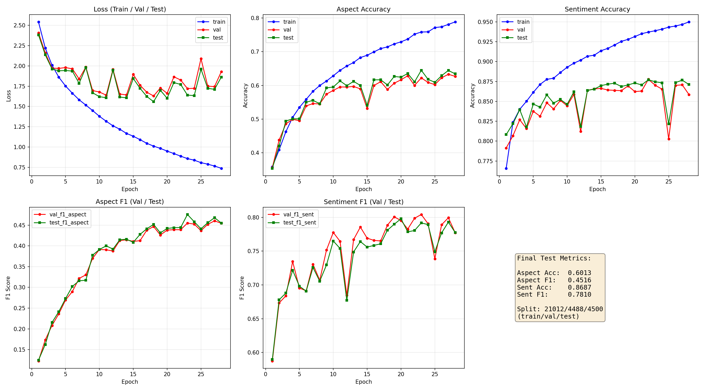
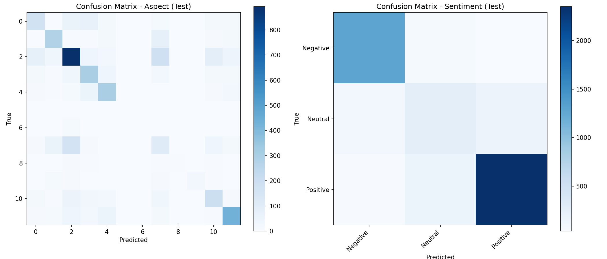

# ABSA Training Report

- **Run ID**: `20260528-235501`
- **Architecture**: `paper`
- **Device**: `cuda`
- **CSV**: `C:\Users\Administrator\Desktop\ABSANLPFN - Copy\ok050824.csv` (103923 total rows)
- **Samples used**: 30000 (max_samples=30000)
- **Split**: Train 21012 / Val 4488 / Test 4500 (70/15/15)
- **Epochs**: 100
- **Batch size**: 128
- **Learning rate**: 0.001
- **Dropout**: 0.25
- **Max len**: 62

## Results on TEST Set

| Task | Accuracy | Precision | Recall | F1 |
|------|----------|-----------|--------|-----|
| Aspect | 0.6013 | 0.4874 | 0.4415 | 0.4516 |
| Sentiment | 0.8687 | 0.7809 | 0.7812 | 0.7810 |

## Results on Validation Set

| Task | Accuracy | Precision | Recall | F1 |
|------|----------|-----------|--------|-----|
| Aspect | 0.5878 | 0.4760 | 0.4383 | 0.4465 |
| Sentiment | 0.8634 | 0.7883 | 0.7895 | 0.7885 |

## Training Curves

## Confusion Matrix (Test Set)

## Training History (Last 5 Epochs)

| Epoch | Train Loss | Val Loss | Test Loss | Val Acc Asp | Test Acc Asp | Val F1 Asp | Test F1 Asp | Val Acc Sent | Test Acc Sent | Val F1 Sent | Test F1 Sent |
|-------|-----------|---------|----------|------------|-------------|-----------|------------|-------------|--------------|------------|-------------|
| 24 | 0.8384 | 1.7240 | 1.6333 | 0.6087 | 0.6180 | 0.4524 | 0.4582 | 0.8654 | 0.8733 | 0.7905 | 0.7893 |
| 25 | 0.8076 | 2.0896 | 1.9603 | 0.6023 | 0.6091 | 0.4366 | 0.4411 | 0.8028 | 0.8218 | 0.7387 | 0.7490 |
| 26 | 0.7888 | 1.7505 | 1.7232 | 0.6225 | 0.6289 | 0.4519 | 0.4557 | 0.8701 | 0.8736 | 0.7891 | 0.7770 |
| 27 | 0.7660 | 1.7448 | 1.7112 | 0.6330 | 0.6444 | 0.4601 | 0.4678 | 0.8708 | 0.8767 | 0.7994 | 0.7930 |
| 28 | 0.7378 | 1.9286 | 1.8615 | 0.6268 | 0.6342 | 0.4544 | 0.4550 | 0.8585 | 0.8711 | 0.7773 | 0.7776 |
