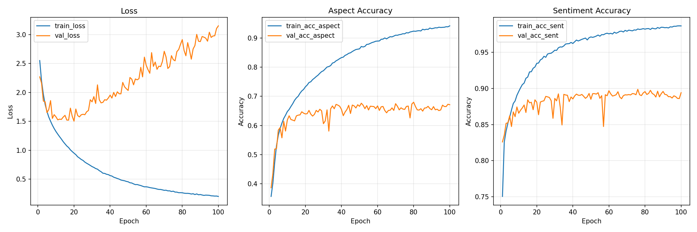

# ABSA Training Report

- **Run ID**: `20260528-211023`
- **Architecture**: `paper`
- **Device**: `cpu`
- **CSV**: `C:\Users\Administrator\Desktop\ABSANLPFN - Copy\ok050824.csv` (103923 total rows)
- **Samples used**: 30000 (max_samples=30000)
- **Train/Val split**: 25500 / 4500
- **Epochs**: 100
- **Batch size**: 128
- **Learning rate**: 0.001
- **Dropout**: 0.25
- **Max len**: 62

## Final Metrics (Validation Set)

| Task | Accuracy | Precision | Recall | F1 |
|------|----------|-----------|--------|-----|
| Aspect | 0.6682 | 0.5247 | 0.5072 | 0.5116 |
| Sentiment | 0.8940 | 0.8240 | 0.8099 | 0.8165 |

## Training Curves

## Last 5 Epochs

| Epoch | Train Loss | Val Loss | Train Acc Aspect | Val Acc Aspect | Train Acc Sent | Val Acc Sent |
|-------|-----------|---------|-----------------|---------------|---------------|-------------|
| 96 | 0.2118 | 2.9504 | 0.9368 | 0.6698 | 0.9862 | 0.8898 |
| 97 | 0.2101 | 2.9747 | 0.9372 | 0.6652 | 0.9861 | 0.8887 |
| 98 | 0.2068 | 2.9792 | 0.9389 | 0.6649 | 0.9867 | 0.8862 |
| 99 | 0.2075 | 3.1052 | 0.9386 | 0.6729 | 0.9868 | 0.8860 |
| 100 | 0.2009 | 3.1503 | 0.9420 | 0.6713 | 0.9867 | 0.8941 |
